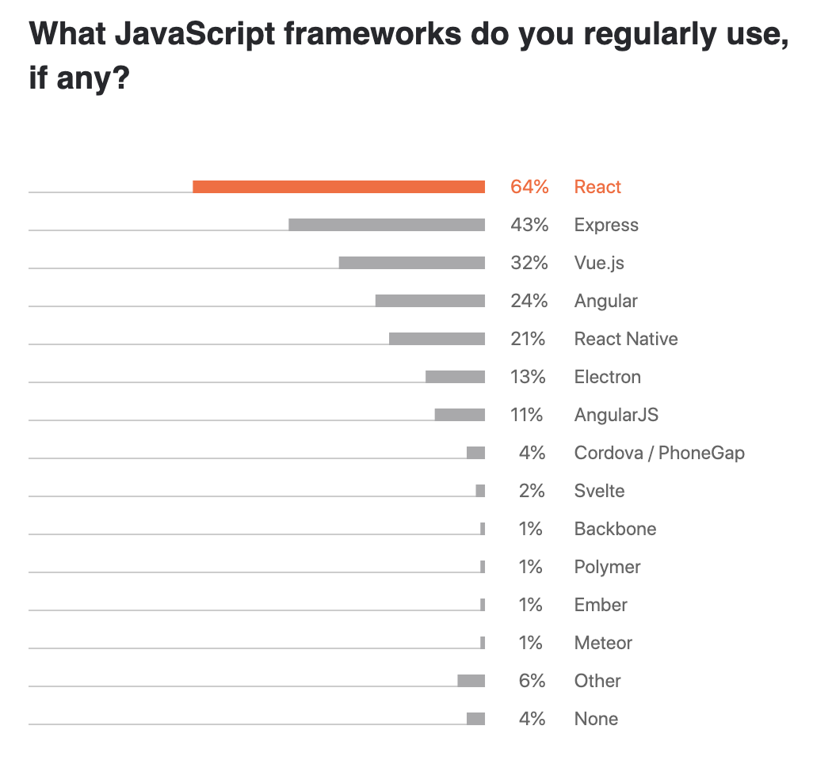
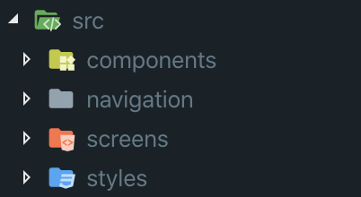

In this tutorial, we are going through the basics so you can start developing your own mobile apps and also understand what makes React Native such a powerful framework.

### Prerequisites

In order to make the most out of this tutorial, you must be knowledgeable about React and JavaScript. Even though the code that you'll see here is nothing too complex, it's important to have some basic understandings with Javascript language.

Regarding hardware, you can use any laptop/PC that runs rather IOS, Windows or Linux, but be aware that if you want to see your mobile app coming to life in your iPhone (physical or virtual) you really need to run your code on a Mac.

Choose your favorite IDE (mine is [VSCode](https://code.visualstudio.com/)) and you are ready to go!

### Why React Native?

Well, I think that's a fair question. What makes React Native such a famous framework for developing mobile applications? Why some developers/companies use React Native instead of native languages like [Swift](https://developer.apple.com/swift/) or [Java](https://docs.oracle.com/javase/7/docs/technotes/guides/language/)?

Let's see some benefits:

* #### Is Cross-Platform

One of the biggest advantages of developing with this framework is that allows you to create a mobile app for both IOS and Android with the same code base.

This means that if you are a company and you want to develop for both Operations Systems(OS), instead of hiring a team for each OS, you can now hire one team to do the work. You'll save not just money but also time.

With React Native you can 

* #### Reusable code

If you worked with React before, all the expertise that you gained can be applied in React Native as well.

> Learn once, write anywhere.

React and React Native share the same logic, where you build your app by creating smaller components and use them the way you want it. The only difference (is a big difference I know) is that while in React you are running your code in the browser, in React Native you will run it in a completely different environment: Mobile. 

Because of this environment difference, you are not able to manipulate the DOM because (guess what) there is no DOM! So instead of writing:

```jsx
import React from 'react';

const Greetings = () => {
  return(
   <div>
      <p>Hello there! 👋</p>
   </div>
  )
}

export default Greetings
```

You must use components that our mobile environment can understand:

```jsx
import React from 'react';
import { View, Text } from 'react-native';

const Greetings = () => {
  return(
   <View>
      <Text>Hello there! 👋</Text>
   </View>
  )
}

export default Greetings
```

In the example above `<View>` creates a new division on your screen while `<Text>` is used when you want to render text [^1].

[^1]: In React Native there are no header tags like h1, h2, h3... so what you can do is to render your content in a Text tag and styling it accordingly.

If you are curious about all components that  React Native offers, [take a look](https://reactnative.dev/docs/components-and-apis).

* #### Big community

According to [Jetbrains](https://www.jetbrains.com/lp/devecosystem-2020/javascript/), React is the most used library in the Javascript ecosystem.



As you can imagine, it's a huge advantage when you work with technology with a solid community behind. You're going to need assistance every time you're stuck in some kind of bug, and if you are able to find your solution on the first Google's results, your progress will be much faster.

### Environment Setup

Okay, so let's get our hands dirty and start. The first thing you need to do in order to build your apps in React Native is to set up your environment. 

React Native gives you two options to start:

* Expo CLI - If you are new to mobile development, they suggest you install this tool. Basically, Expo is a set of tools built around React Native which allows you to create mobile apps very fast and you just need to have Node.js installed on your laptop.
* React Native CLI - For this one, you need to install XCode and Android Studio, which are the software to develop for IOS and Android, respectively. In case you want to build just for one OS you can install only that integrated development environment.

For this tutorial, we're going to choose the second option.

React Native docs have an awesome step by step guide, to setting up your environment and for that reason, I won't try to improve that explanation. You can access it [here](https://reactnative.dev/docs/environment-setup) and follow the instructions:

1. Choose "React Native CLI Quickstart"
2. Choose your Development OS - if you are on a Windows, Linux, or a Mac.
3. Choose your Target OS - Do you want to develop for Android or IOS? If you want both, you need to follow both instructions.

It's a lot of steps but the good thing is that you just need to do it once.

After you have your environment ready, you can now start creating your first app

### Folder structure

Every time you want to create an app you need to run on your command terminal:

`npm react-native init nameOfMyApp`

Where "nameOfMyApp" is the name that you want to give to your project.

After opening your project, you can see all files and folders generated by React Native. By convention, you should create a new folder called "src" (stand by source), where you're going to put inside all code responsible for the app.

There are several ways to structure this *src folder*, but for this project, we're going to create 4 new folders inside:

* Components: This folder is where we place all small components, so you can reuse them on your screens.
* Navigation: Responsible to manage navigation features.
* Screens: Manage all screens of your app.
* Styles: Here, we'll have the styling responsible to style our components and screens [^2].

[^2]: Either you can create a global style folder where you manage the entire style of your app, or you can create an individual style file for each of your components/screen. This will depend on how you like to structure your application and also the size of it. If you want to create a more complex app, with a lot of components, is advisable to have a style file for each, in order to avoid end it up with a huge global style file.

In the end, you'll have something like the image below:



### Styling

Inside Screens folder, let's start by creating a *Home.js* file, where it's going to be responsible to render our Home Screen. Since we want to style this screen, we can create a new styling file inside our *styles* folder called *Home.styled.js*.

Here is the code to create a simple Home Screen:

```jsx
//Home.js
import React from 'react';
import { SafeAreaView, Button } from 'react-native';

import { styles } from '../styles/Home.styled';

const Home = () => {
   return (
    <SafeAreaView style={styles.container}>
      <Text style={styles.text}>
        This is the Home Page
      </Text>
    </SafeAreaView>
  );
};

export default Home;
```

And now, let's create our style file:

```js
// Home.styled.js
import { StyleSheet } from 'react-native';

export const styles = StyleSheet.create({
  container: {
    backgroundColor: '#f5b971',
    flex: 1,
  },
  text: {
    fontSize: 30,
    fontWeight: 'bold',
    color: '#d7385e',
    alignSelf: 'center',
    marginTop: 300,
  },
});
```

React Native offers a great way to create a style object with [StyleSheet](https://reactnative.dev/docs/stylesheet). StyleSheet is an abstraction similar to CSS StyleSheets. Each key on this object is responsible to style a different element.

In our case, we created a StyleSheet with two keys: "container" and "text"

To use it in *Home.js*, we need to import as we see on the third line of code.

`import { styles } from '../styles/Home.styled';`

Now, we can specify where we want to apply our style by using `styles.` and the name of our styled object's key.

We add a background color to our container, which is the *SafeAreaView* component and also changed the font size, color and alignments to our *Text* component.

As a result, we have this:


### Navigation

While in React you manage navigation between pages by using React Router, in React Native, we have something similar that allows us to go from screen A to screen B called [React Navigation](https://reactnavigation.org/).

The goal of React Navigation is to create a navigation structure in your app. The last version is 5.0 released in February 2020.

In order to get use this tool in your app you should run on terminal the following commands:

`npm install @react-navigation/native`


### Animation